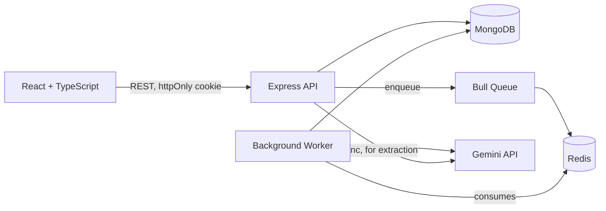

# Lead Intelligence System


An AI-powered B2B lead qualification system: scores inbound leads against
a transparent rubric, drafts outreach, and keeps a human reviewer in the
loop at every step. Built as a full-stack, multi-tenant product - not a
script - with background job processing, authentication, and a live
Responsible AI page.

## Why This Exists

Most "AI demo" projects show a single API call. This one shows what it
actually takes to put an LLM in front of real users safely: schema
validation on AI output, rate-limit-aware job queuing, per-account data
isolation, and a documented trust boundary between what the AI claims
and what a human has to verify.

## Architecture



Scoring is asynchronous (queued) - the user doesn't wait on it.
Extraction is synchronous - it's an interactive preview the user is
actively watching.

## Tech Stack

| Layer | Choice | Why |
|---|---|---|
| API | Express + TypeScript | Type safety across a non-trivial AI integration surface |
| AI | Gemini 2.5 Flash | Behind an `AIProvider` interface - swappable, not hard-coded |
| Validation | Zod | Validates both client input and AI output - AI responses are never trusted blindly |
| Queue | Bull + Redis | Decouples slow AI calls from the HTTP request lifecycle |
| DB | MongoDB Atlas | Document model fits variably-shaped AI output naturally |
| Auth | JWT in httpOnly cookies | Inaccessible to client-side JS, mitigating XSS token theft |
| Frontend | React + TypeScript + Vite | — |
| Styling | Tailwind v4 | Custom skeuomorphic design system (see below) |
| Animation | GSAP (`useGSAP`) | Handles React 19 + cleanup correctly out of the box |
| CI | GitHub Actions | Type-check + build on every push, server and client independently |

## Design System

Light mode, paper/brass/steel palette, General Sans + IBM Plex Mono.
The signature element is an analog SVG gauge whose needle animates to
the lead's score - chosen because the product's core action is
*measurement*, and real measurement instruments are dials, not progress bars.

## Getting Started

### Prerequisites
- Node 20+
- MongoDB Atlas connection string
- Redis Cloud connection details
- A Gemini API key (aistudio.google.com)

### Server
```bash
cd server
npm install
cp .env.example .env   # fill in MONGODB_URI, GEMINI_API_KEY, REDIS_*, JWT_SECRET
npm run dev             # API on :5000
npm run worker          # separate terminal - background job processor
```

### Client
```bash
cd client
npm install
cp .env.example .env   # set VITE_API_URL
npm run dev              # on :5173
```

## Project Phases

| Phase | Scope |
|---|---|
| 1 | API foundation, Gemini scoring, validation |
| 2 | Background job queue, rate-limit hardening |
| 3 | React dashboard, CI, design system |
| 4 | Authentication, per-account data isolation |
| 5 | Flexible lead capture (paste-and-extract) |
| 6 | Responsible AI documentation, live trust page |

Full history in [CHANGELOG.md](./CHANGELOG.md).
Responsible AI design decisions in [RESPONSIBLE_AI.md](./RESPONSIBLE_AI.md).
Manual-vs-AI time comparison in [docs/PROCESS_MAP.md](./docs/PROCESS_MAP.md).

## Screenshots

_Add screenshots to `docs/screenshots/` and reference them here, e.g.:_
``

## License

MIT