# Manual vs. AI-Assisted Lead Qualification

## Before / After Time Estimate

| Step | Manual | AI-Assisted |
|---|---|---|
| Research the lead | 5-8 min | Included in paste-and-extract (~10 sec) |
| Score against criteria | 3-5 min (subjective) | ~5-10 sec (consistent rubric) |
| Draft first email | 5-7 min | Included in AI output |
| Draft LinkedIn message | 2-3 min | Included in AI output |
| Decide follow-up timing | 1-2 min | Included in AI output |
| Human review of AI draft | — | 2-3 min |
| **Total** | **~16-25 min/lead** | **~3-4 min/lead** |

These are estimates based on typical SDR workflow timing, not a
controlled study — stated as such deliberately, not as a verified
benchmark.

## Process Flow

```mermaid
flowchart TB
    subgraph Manual["Manual Process (~16-25 min)"]
        A1[Read lead info] --> A2[Research company/role]
        A2 --> A3[Manually score vs. gut feel]
        A3 --> A4[Write first email from scratch]
        A4 --> A5[Write LinkedIn message]
        A5 --> A6[Decide follow-up timing]
        A6 --> A7[Update CRM manually]
    end

    subgraph AI["AI-Assisted Process (~3-4 min)"]
        B1[Paste raw text OR fill form] --> B2[AI extracts structured fields]
        B2 --> B3[Human confirms/edits fields]
        B3 --> B4[Submit - job queued]
        B4 --> B5[AI scores against fixed rubric]
        B5 --> B6[AI drafts email + LinkedIn + follow-up]
        B6 --> B7[Human reviews and approves]
        B7 --> B8[Lead status: reviewed]
    end
```

## What Changed Structurally, Not Just Speed

The manual process has no enforced consistency — two reps might score
the same lead differently. The AI-assisted process applies the same
five-factor rubric every time, and *always* produces a review checkpoint
- it cannot skip straight to "actioned" without a named human reviewer.